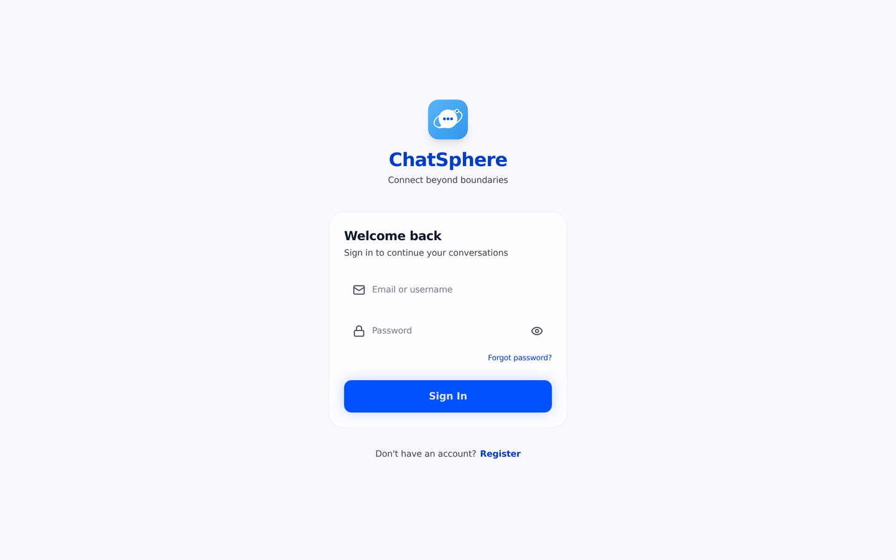
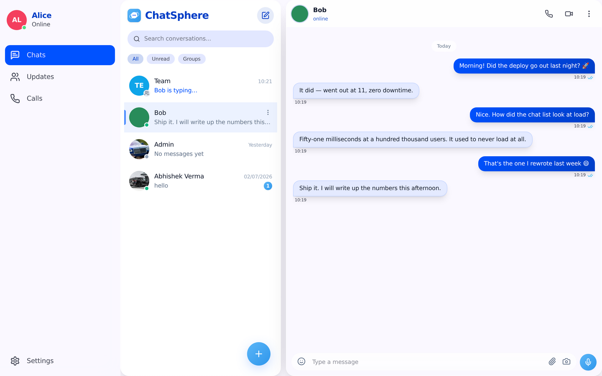
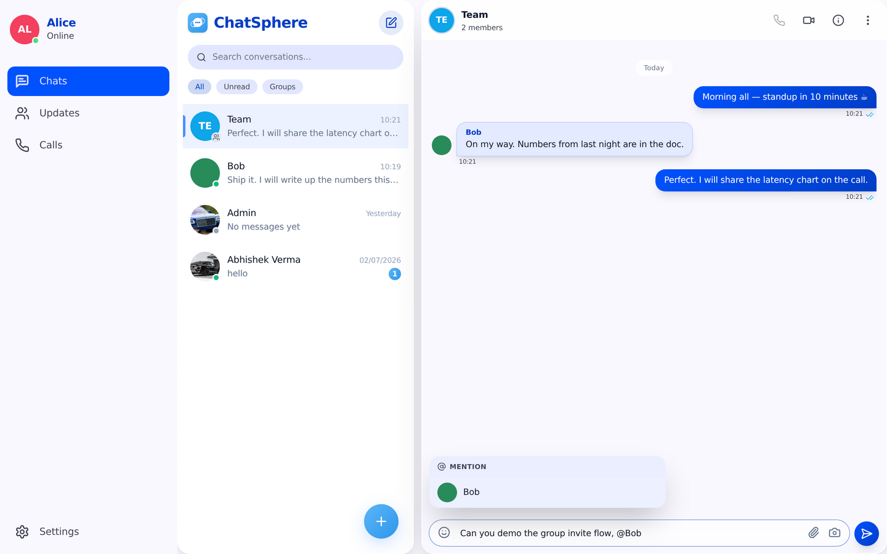
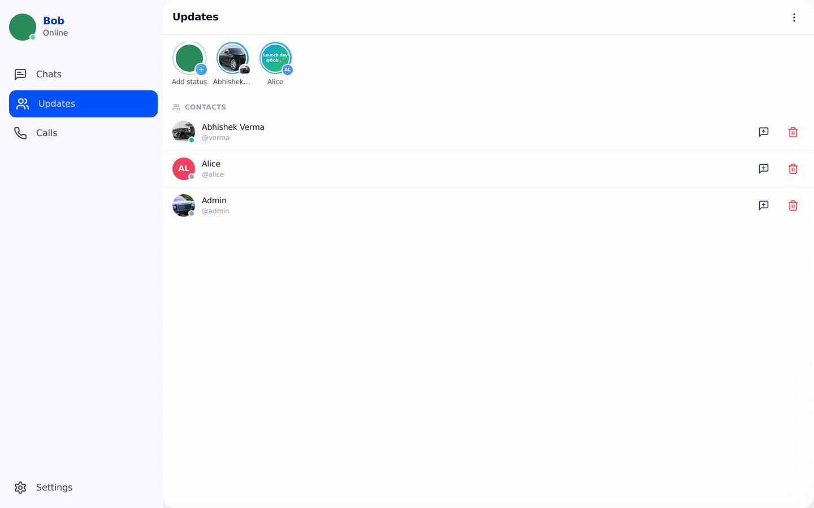
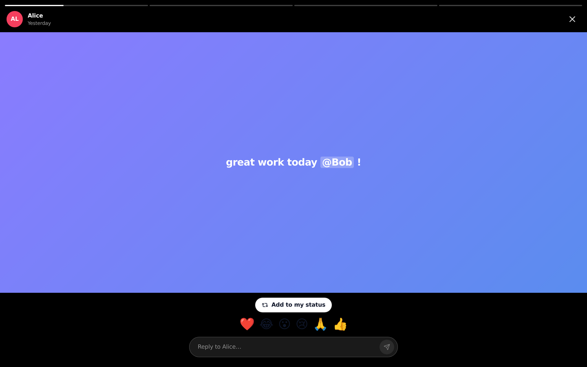
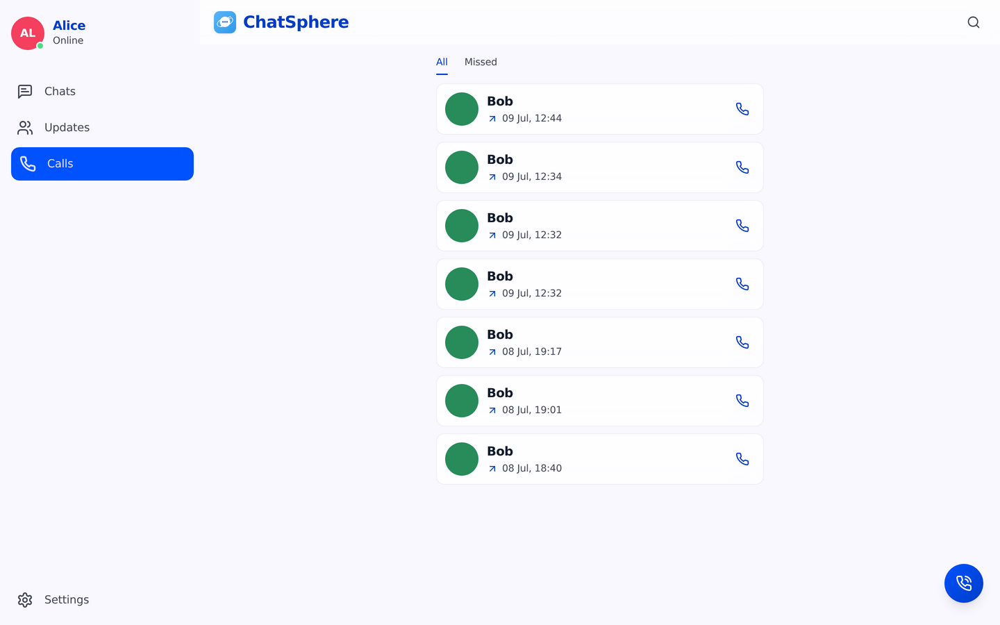
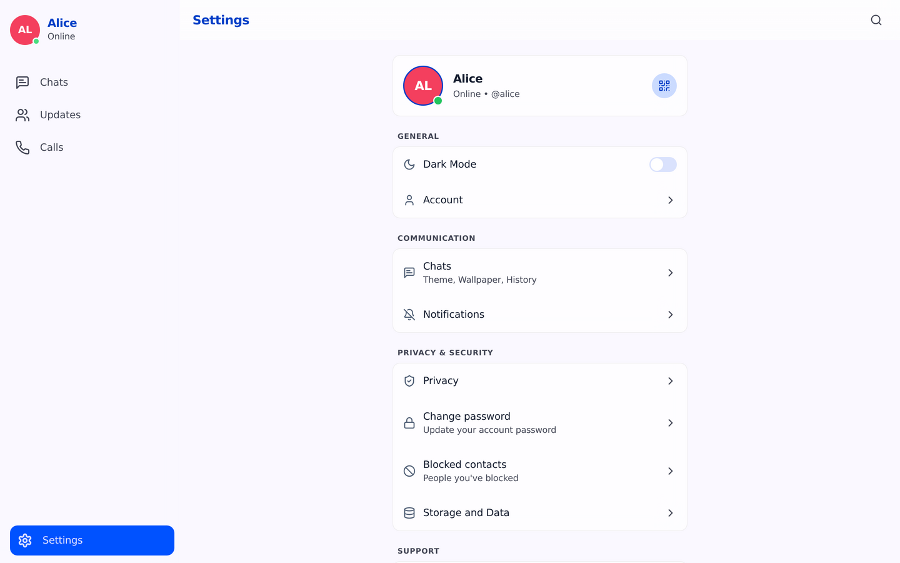
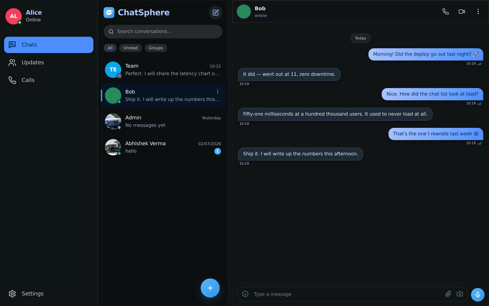

# ChatSphere

A real-time, WhatsApp-style chat application — 1:1 and group chat, 24-hour statuses with
music, voice and video calling, contacts by QR or invite link, and a lot of care spent on
making it fast. Full stack, and **everything runs in Docker** — no host tooling (Java,
Node, Maven) required.


- **Backend** — Java 21, Spring Boot 3.3 (modular monolith), Spring Security (JWT),
  WebSocket + STOMP, Spring Data JPA, MySQL, Flyway, Redis, Kafka, MinIO.
- **Frontend** — React 19, TypeScript, Vite, React Router, TanStack Query, Zustand,
  Tailwind CSS, SockJS + STOMP, React Hook Form + Zod, PWA.

> **New to the codebase? Read [`DEVELOPER_GUIDE.md`](DEVELOPER_GUIDE.md).** It walks
> through the whole system: how a message actually travels from one keyboard to another
> screen, the data model, the frontend conventions, the security model, and *why* several
> things are built the way they are — a few of them look wrong until you know the story.

---

## Quick start

The only requirement on your machine is **Docker** (with Docker Compose).

```bash
# 1. Clone
git clone https://github.com/Abhishek0732/chatsphere.git
cd chatsphere

# 2. Create your env file from the template
cp .env.example .env
#    Edit .env if you like. To share the app with others on your network, set
#    PUBLIC_HOST to your LAN IP (e.g. 192.168.1.50) instead of "localhost".

# 3. Build + start the whole stack (detached)
docker compose up -d --build
#    or: make up

# 4. Wait for the backend to become healthy (~1 min on first run)
docker compose ps
docker compose logs -f backend    # look for "Started ... in N seconds", then Ctrl-C
```

First build takes a few minutes (Maven + npm run inside the containers). Then:

| Service | URL |
|---|---|
| Frontend (app) | http://localhost:5173 |
| Backend API | http://localhost:8080/api |
| Backend health | http://localhost:8080/actuator/health |
| Mailpit (reads OTP / reset mail) | http://localhost:8025 |
| Adminer (DB UI) | http://localhost:8081 |
| MinIO console | http://localhost:9001 |

### Demo accounts (seeded)

| Username | Password | Role |
|---|---|---|
| `admin` | `password` | ADMIN |
| `alice` | `password` | USER |
| `bob` | `password` | USER |

You can also register a new account from the UI.



> **Try it:** open the app in two browsers, log in as `alice` and `bob`, start a chat, and
> watch messages, typing indicators, presence dots and read receipts update live.

---

## What it does

### Real-time chat

1:1 and group chat over a WebSocket. Messages appear optimistically the instant you press
Enter and are reconciled with the server echo, so the UI never waits on the network.
Typing indicators, presence dots, read receipts (the double ticks), replies, reactions,
editing, pinning, forwarding, per-user "clear chat", and full-text search are all in.

Typing indicators are live across the whole conversation list, not just the open chat —
here Bob is typing in **Team** while Alice is reading her chat with him:



### Groups, with @mentions

Type `@` to tag someone in a group. Mentioned people get a notification; everybody else
just gets the message and an unread badge (this is deliberate, and it is the difference
between a group message costing 2 database writes and costing 500 — see the
[developer guide](DEVELOPER_GUIDE.md#92-a-group-message-does-not-notify-the-whole-group)).



Adding someone who is **not** already a contact sends them an **invitation** to join
rather than dropping them into the group — consent is required to reach someone here.

### Statuses (stories)

24-hour statuses: photo, video or text, with a background, a real searchable music
catalogue, and a preview (with the song playing) before you post. Audience control is
per-status — everyone, everyone-except, or only-these-people.



You can **@mention** people in a status. Anyone you tag can then **add that status to
their own** — exactly like WhatsApp — and the copy stays credited to the original author.
Only the people actually tagged can do this; it is enforced on the server, not just hidden
in the UI.



### Calls

Voice and video calling. The server does signaling only — the media is native
peer-to-peer WebRTC, relayed through TURN (self-hosted Coturn, with a public fallback) so
calls connect across networks. Ring timeout, busy/unavailable handling, and a full call
log.



### End-to-end encrypted direct messages

Direct chats are end-to-end encrypted, and the sentence that matters is: **the server
cannot read them.** It stores ciphertext (`v1.<iv>.<ciphertext>`) and forwards it. The
keys are ECDH P-256 + AES-GCM, done with the browser's own WebCrypto; your private key is
wrapped with your password (PBKDF2) before it is ever stored, so you can restore it on a
new device and the server still cannot open it.

Two consequences are real, and are implemented rather than hidden:

- **Server-side search cannot find encrypted messages.** There is nothing to index.
- **Notification previews say "🔒 sent you a message"**, not the text. If the server could
  preview it, the encryption would be a lie.

Being equally plain about the limits: there is **no forward secrecy** (a stolen private
key reads that conversation's past), **groups are not encrypted**, **attachments are not
encrypted**, and it protects you from the *server* — not from an attacker who can run
script in your browser.

### Notifications that reach a closed app

Web Push: a message, mention or invite still notifies you when ChatSphere is shut — not
just when a tab happens to be open. The payload is encrypted per device, so the push
service itself cannot read your message, and only people who are **offline** are pushed
(someone who is connected already got it over the socket).

Turn it on in **Settings → Notifications**. It needs VAPID keys:

```bash
make vapid-keys                 # prints two lines — paste them into .env
docker compose up -d backend
```

Without keys, push simply stays off and everything else works.

### Send while offline

Type on a train, in a lift, or on a dying connection: the message is **queued**, not
lost. It shows as *waiting*, survives a reload, and is sent automatically — in the order
you typed it — the moment you are back.

### Everything else

Contacts by request, QR code or short invite link (`/i/<code>`); blocking (with history,
so messages sent while you had someone blocked stay hidden); notifications; email OTP at
signup and password reset; account deletion that anonymises you without tearing holes in
other people's chat history.



And it is themeable — light and dark, with accent colour, wallpaper, font and corner
radius all user-tunable:



---

## Built for scale

The app is built to stay fast at **lakh scale** (100k users, 2M messages) — that is a
standing requirement, not an afterthought. Measured on a seeded 100k-user / 2M-message
database, with hundreds of people chatting at the same moment over real WebSockets:

| | |
|---|---|
| 200 concurrent 1:1 chatters, end-to-end delivery | median **98ms** · p95 329ms · p99 440ms |
| Busy 500-member group | median **61ms** (was 2426ms) |
| Chat list | **51ms** (was >40s — it never loaded) |
| Open a chat | **18ms** |
| Search | **7–8ms** |
| Messages lost | **zero** |

How, in one line each: the last message and the unread count are **denormalised** onto the
conversation instead of derived; the send path is a **single INSERT** with the pointers,
badges, notifications and Kafka publish moved after the commit; the hot path is **cached**
(≈13 SQL queries per message became ≈2); live frames go **only to members who are actually
connected**; search is **FULLTEXT**, never `LIKE '%q%'`; and all realtime delivery goes
through a **Redis pub/sub relay** so the app is correct across multiple backend instances.

The full reasoning — including the four real defects that made delivery take three
seconds under load — is in [`DEVELOPER_GUIDE.md`](DEVELOPER_GUIDE.md#10-performance-the-rules-this-codebase-lives-by),
and the commit history reads as post-mortems.

---

## Architecture

```
                    ┌───────────── React SPA (nginx) ─────────────┐
                    │  REST /api      WebSocket /ws     /media    │
                    └───────┬──────────────┬───────────────┬──────┘
                            │              │               │
                     ┌──────▼──────────────▼──────┐   ┌────▼────┐
                     │      Spring Boot backend   │   │  MinIO  │
                     │  controllers · services    │   └─────────┘
                     └──┬────────┬────────┬───────┘
                        │        │        │
                  ┌─────▼──┐ ┌───▼───┐ ┌──▼────┐
                  │ MySQL  │ │ Redis │ │ Kafka │
                  └────────┘ └───────┘ └───────┘
```

- **MySQL** — everything durable; schema is Flyway-managed (`V1`…`V28`).
- **Redis** — presence, rate limiting, OTP codes, call locks, *and* the pub/sub bus that
  makes multi-instance realtime delivery work.
- **Kafka** — a message-event stream; today its only consumer writes an audit line. It is
  a seam for a future service, not load-bearing.
- **MinIO** — uploads, avatars and generated thumbnails, served same-origin via `/media`.

Backend modules (one deployable, package-per-module): `auth`, `user`, `contact`, `chat`,
`group`, `status`, `call`, `block`, `notification`, `media`, `presence`, `search`,
`music`, `admin`, plus `common` (security, config, caching, realtime relay, rate limiting)
and `messaging` (Kafka).

---

## Tests

```bash
make test-unit   # 92 backend unit tests — no DB, no Spring context. ~5s.
make test-e2e    # 10 end-to-end checks against the running stack (make up first)
make test        # both
```

These are deliberately aimed at the bugs this app has actually shipped: messages silently
**lost** under concurrency (20 rapid sends, all 20 must persist), a **deleted user**
breaking everyone else's chat list, a status re-shared by someone who was never tagged,
and a rate limiter that does not limit. Nothing to install — they run in Docker.

## Common commands

```bash
make up            # build + start everything
make logs          # tail all logs
make backend-logs  # tail backend only
make down          # stop (keep data)
make clean         # stop + wipe volumes (DB, MinIO)
make rebuild       # no-cache rebuild
make vapid-keys    # generate Web Push keys for .env
```

## Configuration

All configuration is via `.env` (ports, credentials, JWT secret, TTLs). Copy the committed
`.env.example` template to `.env` and adjust — your real `.env` is gitignored so secrets
never get committed. **Change `JWT_SECRET` before any real deployment.**

⚠️ The frontend's API and WebSocket URLs are `VITE_*` variables, which Vite bakes in **at
build time**. After changing `PUBLIC_HOST` you must rebuild:
`docker compose up -d --build frontend backend`.

## Documentation

| File | What's in it |
|---|---|
| [`DEVELOPER_GUIDE.md`](DEVELOPER_GUIDE.md) | The full system: message path, data model, frontend conventions, security, performance rules, and the decisions that look odd until you know why |
| [`PROJECT_STATUS.md`](PROJECT_STATUS.md) | Per-feature breakdown of what is implemented vs. scaffolded |

## Notes on scope

This repository implements the full ChatSphere roadmap as a **modular monolith** that runs
end-to-end on Docker. The Spring Cloud microservice split and the Kubernetes manifests are
deliberately not done — see `PROJECT_STATUS.md`.
